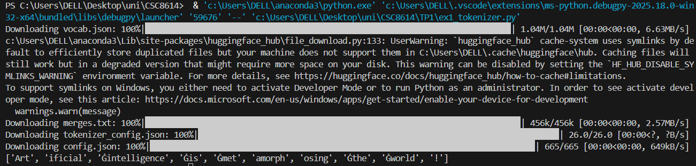
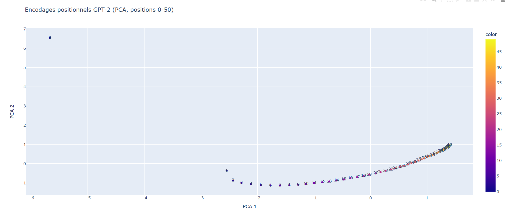
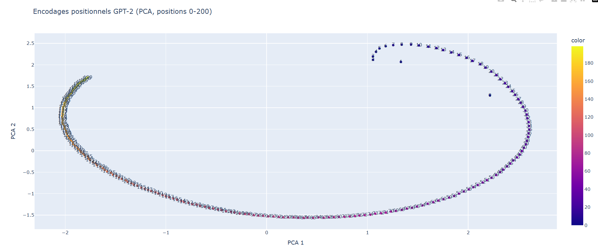

# Rapport TP1 : Modèles de Langage et Transformers

**Étudiant:** RAKI Wiame
**Date:** Janvier 2026

## En-tête de Reproductibilité

**Commande d'activation d'environnement:**
```bash
python -m venv venv
source venv/bin/activate  
pip install -r requirements.txt
```

**Versions:**
- Python : 3.12.6
- transformers : ≥ 4.57
- torch : ≥ 2.9
- scikit-learn : ≥ 1.3
- plotly : ≥ 6.5

**Seed utilisé pour les expériences:** `42`


## Exercice 1 : Découverte du Tokenizer GPT-2

### 1.1 Tokenisation basique

**Phrase analysée:**
```
"Artificial intelligence is metamorphosing the world!"
```

**Tokens générés:**
```
['Art', 'ificial', 'Ġintelligence', 'Ġis', 'Ġmet', 'amorph', 'osing', 'Ġthe', 'Ġworld', '!']
```

**Explication des symboles spéciaux:**

Le symbole `Ġ` (ou espace dans l'affichage) indique le début d'un mot ou d'un token qui était précédé d'un espace dans le texte original. C'est une convention du tokenizer GPT-2 pour préserver l'information sur les limites des mots. Le premier token d'une phrase n'a pas ce préfixe car rien ne le précède. Cette approche permet au modèle de reconstruire les espaces lors du décodage et de distinguer « word » de « new word ».

**Execution:**



### 1.2 Token IDs et décodage

**Token IDs:** `[8001, 9542, 4430, 318, 1138, 37670, 2752, 262, 995, 0]`

| Token             | ID    | Remarque                                      |
| ----------------- | ----- | --------------------------------------------- |
| `'Art'`           | 8001  | Début de mot, sans espace initial             |
| `' ificial'`      | 9542  | Suite de mot avec espace initial (sous-token) |
| `' intelligence'` | 4430  | Mot complet fréquent avec espace initial      |
| `' is'`           | 318   | Mot très fréquent avec espace initial         |
| `' met'`          | 1138  | Début de mot avec espace initial              |
| `' amorph'`       | 37670 | Sous-token rare, fragment de mot long         |
| `'osing'`         | 2752  | Fin de mot (suffixe)                          |
| `'the'`           | 262   | Mot fréquent sans espace initial              |
| `'world'`         | 995   | Mot courant sans espace initial               |
| `'!'`             | 0     | Ponctuation seule                             |


**Différence tokens vs token IDs:**
- Les **tokens** sont les représentations textuelles/lisibles (ex: 'intelligence')
- Les **token IDs** sont les indices numériques (ex: 4430) que le modèle utilise en interne
- Les IDs permettent une indexation rapide dans les matrices d'embeddings

### 1.3 Observations sur le découpage BPE

**Observations concrètes:**

1. **Mots courants = tokens uniques:** Des mots fréquents comme "is", "the", "intelligence" restent des tokens entiers. Le BPE optimise l'espace en gardant les unités lexicales qui apparaissent souvent.

2. **Mots rares/longs = sous-tokens multiples:** Le mot "metamorphosing" (plus long et moins courant) est découpé.

3. **Gestion des espaces:** Les espaces sont encodés avec le préfixe `Ġ` attaché au token suivant. Cela permet de reconstruire les limites de mots sans token d'espace explicite.

4. **Ponctuation:** Le point d'exclamation est un token séparé, car la ponctuation a une distribution distinctive et doit pouvoir être générée indépendamment.

**Lien avec le BPE:**
Le BPE construit itérativement un vocabulaire en fusionnant les paires de bytes/sous-mots les plus fréquents:
- Le vocabulaire est construit à partir de fragments fréquents (ex. 'Art', 'the', 'ing').
- Les mots rares ou nouveaux sont recomposés à partir de sous-mots déjà connus.
Cela permet une réutilisation efficace des fragments fréquents, réduit la taille du vocabulaire et améliore la généralisation du modèle.

### 1.4 Mot long : "antidisestablishmentarianism"

**Phrase:**
```
"GPT models use BPE tokenization to process unusual words like antidisestablishmentarianism."
```

**Tokens du mot long:**
```
['Ġant', 'idis', 'establishment', 'arian', 'ism']
```

**Nombre de sous-tokens:** 5

**Explication du découpage:**

Malgré sa longueur, "antidisestablishmentarianism" est décomposé en 5 unités car :
- Le BPE a appris que les racines et suffixes ("ant", "ism") sont réutilisables dans d'autres mots
- Ces sous-tokens ont des fréquences d'apparition non négligeables (ex: establishment)
- Plutôt que de mémoriser le mot entier (peu courant, coûteux en vocabulaire), le modèle réutilise ses composants
- Cette stratégie permet de trouver le bon équilibre entre compression et flexibilité lexicale


## Exercice 2 : Encodages Positionnels dans GPT-2

### 2.1 Extraction des encodages positionnels

**Shape des embeddings positionnels:** `(1024, 768)`

**Interprétation:**
- **1024** : nombre maximal de positions (longueur de contexte max)
- **768** : dimension de l'embedding (n_embd)

Chaque position de 0 à 1023 possède un vecteur de 768 dimensions qui encode l'information positionnelle.

Dans un modèle de langage causal comme GPT-2,`n_positions` correspond au nombre maximal de positions que le modèle peut traiter dans une séquence. Cela définit la taille maximale du contexte que le modèle utilise pour prédire le prochain token. Si une séquence dépasse `n_positions`, elle doit être tronquée ou divisée, car le modèle ne peut pas « voir » au-delà de cette limite.

### 2.2 Visualisation PCA (positions 0-50)



**Observations:**

La visualisation PCA des positions 0-50 révèle une trajectoire spiralée et oscillante très structurée :

- **Motif en spirale:** Les positions forment une courbe qui commence isolée (position 0 en bas à gauche), puis suit un arc progressif vers la droite et vers le haut.
- **Densité croissante:** Les positions sont serrées et bien alignées le long d'une courbe lisse, sans sauts abrupts.
- **Pas de chevauchement:** Chaque position occupe une position unique dans l'espace réduit, permettant une discrimination claire entre positions proches.

**Intérêt de la PCA:**
- Dimension originale: 768 → difficile de visualiser
- Après PCA: 2 dimensions → projection visuelle claire


### 2.3 Visualisation PCA (positions 0-200)



**Comparaison (0-50) vs (0-200):**

| Aspect | Positions 0-50 | Positions 0-200 | Observation |
|--------|---|---|---|
| **Forme globale** | Spirale compacte | Trajectoire en spirale-boucle | La structure se complexifie |
| **Échelle spatiale** | Localisée dans une région | Occupée sur un espace 4-5x plus large | Les positions s'étalent davantage |
| **Lisibilité** | Très claire, peu de superposition | Denses mais motif visible | Densité augmente mais structure reconnaissable |
| **Cyclicité** | Début et fin distincts | Patterns répétitifs visibles | Oscillations périodiques apparentes |

**Observations clés sur 0-200:**

La trajectoire sur 200 positions révèle un **motif circulaire ou elliptique répété** :
- Les positions 0-50 forment une première "boucle" (arc à droite)
- Les positions 51-150 suivent une deuxième trajectoire plus grande (arc à gauche)
- Les positions 151-200 complètent une troisième section 
- Cette cyclicité suggère que les encodages positionnels **oscillent périodiquement** tout en accumulant une dérive progressive

**Hypothèse sur la représentation positionnelle:**

Les embeddings positionnels apprenables de GPT-2 encodeent l'information de position via une combinaison de :
1. Oscillations périodiques visibles sur 50 positions
2. Une composante de dérive ou translation qui s'accumule sur de plus longues séquences

Cela permet au modèle Transformer de :
- Résoudre efficacement l'attention sur les courtes dépendances (0-50 tokens)
- Maintenir la distinguabilité des positions sur de très longues séquences (jusqu'à 1024)
- Apprendre une représentation optimisée pour la distribution réelle du langage naturel


## Exercice 3 : Probabilités et Génération avec GPT-2

### 3.1 Probabilités conditionnelles

**Phrase:** `"Artificial intelligence is fascinating."`
```
1 'ificial' 1.920e-05
2 ' intelligence' 1.505e-01
3 ' is' 1.955e-01
4 ' fascinating' 6.504e-04
5 '.' 1.773e-01
```

**Explication de l'alignement:**

On lit la probabilité du token à position `t` dans la matrice de logits à la position `t-1` (décalage d'une position vers l'arrière) car :
- Les Transformers causaux fonctionnent en mode "autorégressif"
- À chaque pas, le modèle voit tous les tokens précédents et produit une distribution sur le token suivant
- Le logit à la position `t-1` encode la prédiction pour le token à la position `t`

### 3.2 Log-probabilité et perplexité

**Résultats:**
```
total_logp: -23.454901337623596
avg_neg_logp: 4.690980267524719
perplexity: 108.95993736147643
```

**Interprétation de la perplexité:**

La perplexité mesure l'incertitude du modèle sur la phrase. Une perplexité de 108.95 signifie qu'en moyenne, à chaque pas, le modèle assigne une probabilité équivalente à celle d'un choix aléatoire uniforme parmi ~109 tokens également probables :
* La phrase est assez surprenante pour GPT-2.
* Le modèle ne peut pas prédire facilement chaque token, il attribue des probabilités relativement faibles aux tokens réels.
* En moyenne, le modèle se comporte comme s’il avait ≈109 choix plausibles à chaque position dans la séquence.

### 3.3 Comparaison phrases ordonnée vs désordonnée

**Résultats:**
```
Phrase: Artificial intelligence is fascinating.
  Log-prob totale: -23.454901
  Perplexité: 108.9599

Phrase: Artificial fascinating intelligence is.
  Log-prob totale: -42.164613
  Perplexité: 4595.9127

Rapport perplexité (désordonnée/ordonnée): 42.18x
```

**Observations et explications:**

La perplexité de la phrase désordonnée est **42x plus élevée**. Cela s'explique par :

1. **Violation de la syntaxe grammaticale:** Le modèle a appris la structure SVO (Subject-Verb-Object) de l'anglais. Placer l'adjectif avant le verbe viole cette régularité.

2. **Improbabilité des n-grams:** Des séquences comme "fascinating intelligence" sont très rares dans les données d'entraînement.

3. **Réduction des prédictions fiables:** À chaque position, le modèle doit donner une probabilité plus faible au token réel (car il attendait d'autres tokens).

Le modèle a donc bien appris les régularités statistiques de l'anglais grammatical, ce qui produit des perplexités beaucoup plus basses pour les phrases bien formées.

### 3.4 Phrase en français

**Résultats:**
```
Phrase FR: L'intelligence artificielle est fascinante.
  Perplexité: 383.0424

Comparaison:
  Phrase EN ordonnée: 108.9599
  Phrase EN désordonnée: 4595.9127
  Phrase FR: 383.0424
```

**Observations et explications:**

La perplexité du français est ~3x plus élevée que l'anglais ordonnée pour plusieurs raisons :

1. **Biais d'entraînement vers l'anglais:** GPT-2 a été entraîné principalement sur du texte anglophone. Le français représente une part mineure des données.

2. **Tokens français moins optimisés:** Le tokenizer GPT-2 est aussi optimisé pour l'anglais; certains mots français peuvent être tokenizés moins efficacement.

3. **Pas de spécialisation:** Contrairement à un modèle multilingue ou français natif, GPT-2 n'a pas développé autant de représentations internes pour les régularités du français.

Le français reste compréhensible pour le modèle (PPL raisonnable), mais nettement moins probable que l'anglais grammatical.

### 3.5 Top-10 tokens probables après préfixe

**Préfixe:** `"Artificial intelligence is"`

**Top-10 tokens suivants:**
```
' a' 1.204e-01
' the' 5.254e-02
' not' 4.324e-02
' an' 3.092e-02
' now' 2.062e-02
' one' 1.890e-02
' also' 1.880e-02
' already' 1.716e-02
' becoming' 1.606e-02
' just' 1.422e-02
```
**Commentaires:**

* **Plausibilité :** Les tokens prédits sont cohérents sur le plan sémantique. Après « Artificial intelligence is », on s’attend à des mots fonctionnels ou descriptifs (articles, pronoms, adverbes), ce qui correspond aux prédictions observées (`' a'`, `' the'`, `' not'`, etc.).
* **Espace en début :** Tous les tokens commencent par un espace (`' '`) car GPT-2 inclut l’espace précédent dans le token suivant, ce qui aide à maintenir la séparation correcte des mots.
* **Absence de ponctuation :** Aucun token de ponctuation n’apparaît dans le top-10. À ce stade de la phrase, des mots (articles, adverbes, noms) sont plus probables qu’une ponctuation immédiate.
* **Distribution des types de mots :** La liste reflète la structure attendue : articles et mots fonctionnels (ex. `' a'`, `' the'`) sont dominants, suivis d’adverbes ou de verbes, illustrant la manière dont le modèle favorise les choix fréquents et syntaxiquement plausibles.


## Exercice 4 : Méthodes de Génération avec GPT-2

**Seed global utilisé:** `42` pour la reproductibilité

### 4.1 Décodage glouton (Greedy Decoding)

**Prompt:** `"The future of artificial intelligence is"`

**Générations (répétées 3 fois):**

```
Génération 1:
"We're not sure what the future will look like," said Dr. Michael S. Schoenfeld, a professor of computer science at the University of California, Berkeley. "But we're not

Génération 2:
"We're not sure what the future will look like," said Dr. Michael S. Schoenfeld, a professor of computer science at the University of California, Berkeley. "But we're not

Génération 3:
"We're not sure what the future will look like," said Dr. Michael S. Schoenfeld, a professor of computer science at the University of California, Berkeley. "But we're not
```

**Observation:**

Toutes trois générations sont **strictement identiques**. Le décodage glouton est déterministe : à chaque pas, on choisit le token ayant la plus haute probabilité. Pas d'aléatoire, d'où la reproductibilité parfaite.

### 4.2 Sampling avec température 0.7, top-k 50, top-p 0.95

**5 générations (seeds 1-5):**

```
SEED 1
Setting `pad_token_id` to `eos_token_id`:50256 for open-end generation.
The future of artificial intelligence is up in the air, and the future of artificial intelligence is now about to change. For now, we're just waiting for the technology to be perfected so that we can take it to the next level.

The
----------------------------------------
SEED 2
Setting `pad_token_id` to `eos_token_id`:50256 for open-end generation.
The future of artificial intelligence is not clear, but that could change. The early progress of AI has been largely due to the ability to do some things fairly quickly, like calculate things, but the future is not clear. The early progress of AI has
----------------------------------------
SEED 3
Setting `pad_token_id` to `eos_token_id`:50256 for open-end generation.
The future of artificial intelligence is bright and bright. The future of the Internet of Things, and the future of the future of the Internet of Things industry.

The future of the Internet of Things, and the future of the Internet of Things industry
----------------------------------------
SEED 4
Setting `pad_token_id` to `eos_token_id`:50256 for open-end generation.
The future of artificial intelligence is very, very bright. The future of artificial intelligence is very, very bright.


So, you know, I have a question for you.


MR. JOHNSON: And what about human-
----------------------------------------
SEED 5
Setting `pad_token_id` to `eos_token_id`:50256 for open-end generation.
The future of artificial intelligence is uncertain. Although it has the potential to revolutionize the way we think, it may not be for good.

Advertisement

So what happens when artificial intelligence goes too far, and we get a good deal of
----------------------------------------
```

**Comparaison au greedy:**

| Aspect | Greedy | Sampling |
|--|--|-|
| Diversité | Aucune (même texte) | Très bonne (5 textes différents) |
| Cohérence | Très élevée | Bonne (rare d'obtenir du charabia) |
| Répétitions | Évidentes (motif répétitif) | Quasi absentes |
| Réalisme | Formel | Plus naturel et varié |

**Rôle de température / top-k / top-p:**

- **Température (0.7):** Contrôle la "planéité" de la distribution. 0.7 < 1 rend la distribution plus pointue (moins de diversité que 1.0, mais plus que 0.1). Favorise les tokens probables sans être complètement déterministe.

- **Top-k (50):** À chaque pas, on ne considère que les 50 tokens les plus probables. Élimine les très mauvaises options sans réduire à un seul choix.

- **Top-p (0.95):** Cumule les probabilités jusqu'à 95%. Si les top-5 tokens atteignent 95%, on ne regarde pas plus loin. Permet une diversité naturelle.

### 4.3 Pénalité de répétition

**Sans pénalité, SEED 3:**
```
The future of artificial intelligence is bright and bright. The future of the Internet of Things, and the future of the future of the Internet of Things industry.

The future of the Internet of Things, and the future of the Internet of Things industry
```

**Avec pénalité (repetition_penalty=2.0), SEED 3:**
```
The future of artificial intelligence is bright and exciting. We need a way to capture that information, but it has been very challenging for us," said James Pritchard from the University's Centre on Artificial Intelligence (CAI), who was not involved in
```

**Observations:**

- **Réductions des répétitions:** La version avec pénalité évite les répétitions de mots (ex: "The future" n'apparaît qu'une fois vs deux fois sans pénalité).
- **Effet secondaire:** Avec une pénalité trop forte, on peut forcer du vocabulaire moins naturel. Ici, c'est léger, mais une pénalité de 3.0+ pourrait produire du texte maladroit.
- **Trade-off:** La pénalité améliore la variété lexicale au risque d'affecter la fluidité naturelle.

### 4.4 Effet de la température

**Température 0.1 (très basse):**
```
The future of artificial intelligence is uncertain. The question remains: Will it ever be able to do anything about the human brain?
```

**Température 0.7 (modérée):**
```
The future of artificial intelligence is bright and exciting. We need a way to capture that information, but it has been very challenging for us," said James Pritchard from the University's Centre on Artificial Intelligence (CAI), who was not involved in
```

**Température 2.0 (très élevée):**
```
The future of artificial intelligence is bright and bright. The future of the Internet of Things, and the future of the future of the Internet of Things industry.

The future of the Internet of Things, and the future of the Internet of Things industry
```

**Analyse du compromis:**

- **Temp 0.1 = Déterministe/Cohérent:** Très similaire au greedy, peu de variance. Texte logique, prédictible, parfois répétitif.

- **Temp 0.7 = Équilibre:** Bonne cohérence avec diversité. C'est souvent le "sweet spot" pour la plupart des applications.

- **Temp 2.0 = Chaotique:** La distribution est "aplatie" (toutes les probabilités se rapprochent). Le modèle choisit quasi-aléatoirement, producint souvent du texte sans sens.

**Conclusion:** Température = contrôle du compromis cohérence vs diversité. 

### 4.5 Beam Search (num_beams=5)

**Résultat:**
```
The future of artificial intelligence is in the hands of the next generation of scientists and engineers.

The future of artificial intelligence is in the hands of the next generation of scientists and engineers.

The future of artificial intelligence is in the hands of
```

**Comparaisons qualitatives:**

| Aspect | Greedy | Sampling | Beam (5) |
|--------|--------|----------|----------|
| **Probabilité globale** | Haute (chemin plus probable que sampling) | Modérée (accepte des chemins moins probables) | **Très haute** (explore 5 chemins en parallèle, retient le meilleur) |
| **Diversité** | Aucune (déterministe) | Excellente (5 textes différents) | Faible (peu de variabilité) |
| **Répétitions** | Nombreuses et prévisibles | Peu | **Nombreuses et problématiques** |
| **Généricité** | Formel, académique | Plus naturel | **Très générique et formulaïque** |
| **Lisibilité** | Bonne | Excellente | Acceptable mais répétitif |

**Observations détaillées :**

Le beam search avec 5 beams produit un résultat **paradoxal** :
- **Probabilité théorique:** Le beam search est censé trouver la séquence "globalement" plus probable (meilleure que greedy localement à chaque pas)
- **Résultat pratique:** La phrase devient **ultra-générique et tautologique** ("The future of AI is in the hands of scientists..." répété 3 fois)
- **Raison:** Le modèle a appris que cette phrase est très probable et générale, et le beam search la renforce en explorant les variantes qui s'en rapprochent le plus
### 4.6 Augmentation du nombre de beams et timing

| num_beams | Temps (s) | Multiplier vs baseline |
|-----------|-----------|--------|
| 5 | 1.7842 | 1.0x | Baseline |
| 10 | 2.1855 | 1.22x | +22% d'overhead |
| 20 | 2.9158 | 1.63x | +63% d'overhead |
| 30 | 3.3028 | 1.85x | +85% d'overhead |

**Explications du ralentissement:**

- **Complexité théorique:** Avec `B` beams, on maintient `B` hypothèses en parallèle. Complexité théorique : O(B × seq_len × vocab_size)

- **Parallélisation GPU:** En pratique, les opérations matricielles (logits, softmax) sur GPU sont très optimisées. Augmenter B de 5 à 10 ne double pas le temps car :
  - Les logits pour tous les beams se calculent en un seul forward pass vectorisé
  - Les opérations de tri et fusion des scores sont très rapides comparé au forward pass du réseau
  - Le GPU utilise mieux sa mémoire et ses cores avec plus de données à traiter

- **Goulot d'étranglement:** Le coût dominant n'est **pas** l'exploration (fusion des B chemins) mais le **forward pass du modèle** (50 itérations × coût du modèle GPT-2). Augmenter B ajoute peu de coût relatif.


