# Rapport TP4: 

**Étudiant:** RAKI Wiame
**Date:** Janvier 2026

## Question 1:
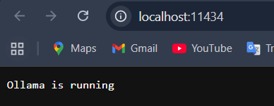
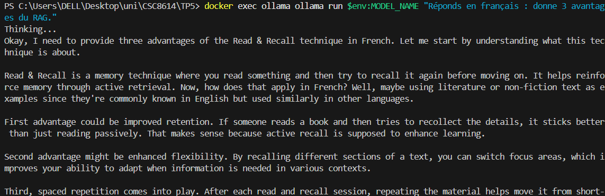

**Résultat généré:**
```
Conseil sur les avantages du RAG (Résumé des Gendarmes) en français :

1. **Améliorer l' retaining** : La technique résonne avec yourself par le défilement et la mise en page. Par exemple, si vous litez un texte et vous allez à revoir chaque partie, vous savez les informations de plus en plus bien intégrées et durably.

2. **Appliquer des flexibilités** : La réflexion consistsante dans les readings consiste à mener sur chaque page d'un texte. Cela permet de renforcer votre flexibilité et de pouvoir se contenter de diffèrent parts du texte, ce qui est essentiel quand il est nécessaire d'adapter le contenu en fonction des besoins spécifiques.

3. **Utiliser la répétition spatiale** : après chaque lecture & recall, vous apprenez à rafraîchir la matière dans les cahiers ou en mettant en page de manière fréquente. Cela permettra à votre part de se démarquer du contenu et de renforcer son stock long-terminal.

En résumé, cette technique met en avant des avantages visuels et éducatifs tout en favorisant l'adaptabilité et la durabilité du savoir-faire.
```
**Port choisi:** `11434`

## Question 2:

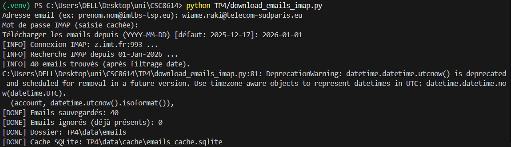
**Nombre d'email:** `40`
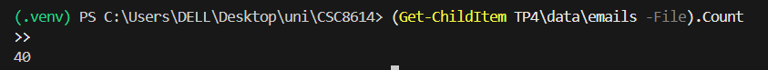
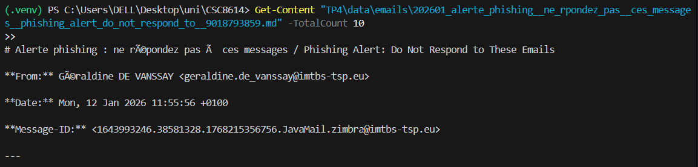

## Question 3:
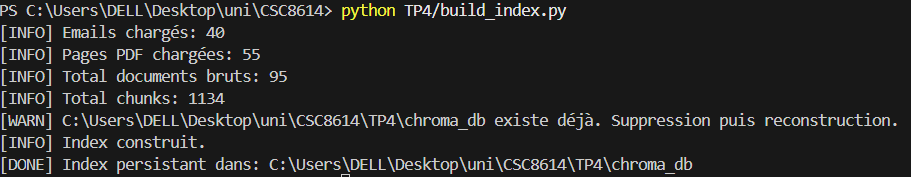
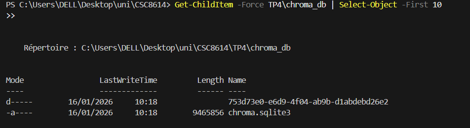

## Question 4:

Pour la question sur les sujets de PFE de Luca Benedetto, les premiers chunks récupérés ne contiennent pas la réponse : ils proviennent surtout de PDFs administratifs ou d’emails hors sujet. Les résultats sont redondants et peu pertinents, ce qui montre que l’index n’est pas optimisé pour ce type de question.

Pour la question sur la validation d’une UE, les premiers chunks contiennent partiellement la réponse, mais plusieurs viennent du même PDF, entraînant une certaine redondance. Le type de document est approprié, ce qui rend le retrieval plus fiable, même si la répétition pourrait être réduite.

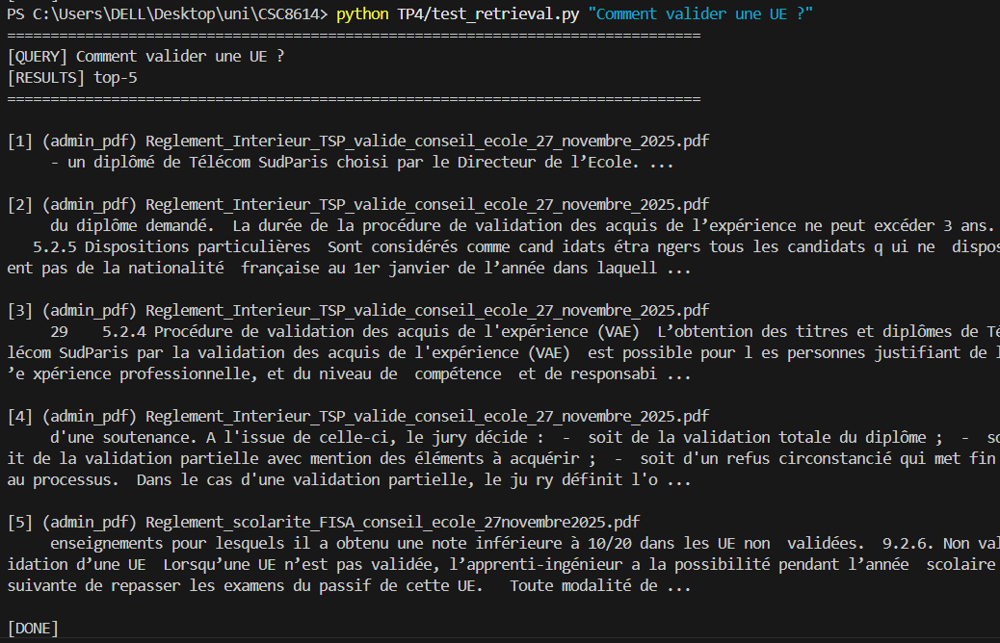
```
TOP K= 5
CHUNK_SIZE = 800
CHUNK_OVERLAP = 80
```
## Question 5:
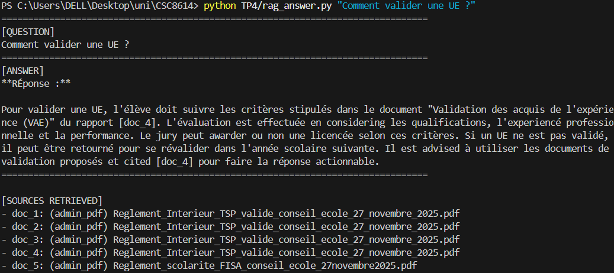
J'ai aussi de tester avec :
```
CHUNK_SIZE = 500
CHUNK_OVERLAP = 50
```
Le model n'est pas robuste : la réexcution d'un prompt génére des réponses différentes (en anglais ou hallucination) le problème est du au manque de données (40 emails sont insuffisants).

## Question 6 :
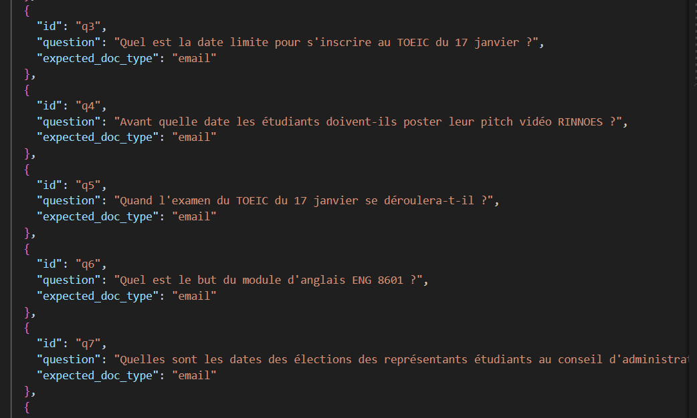
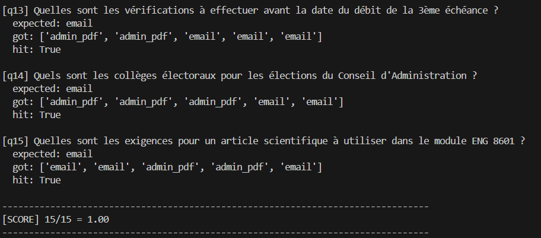

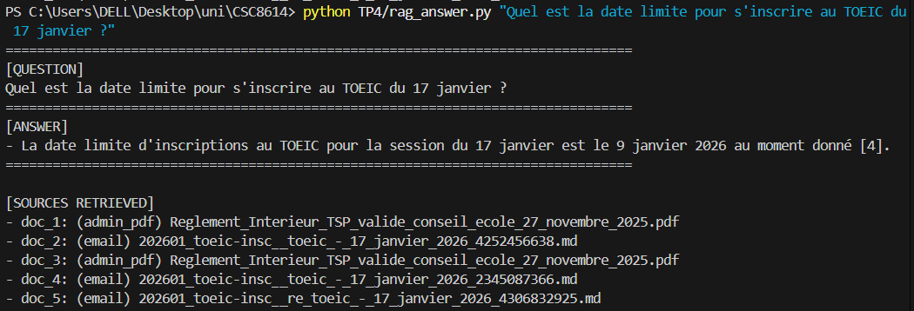
**Score** : 2

Après autre test  :
```
TOP_K=2
CHUNK_SIZE = 400
CHUNK_OVERLAP = 20
```
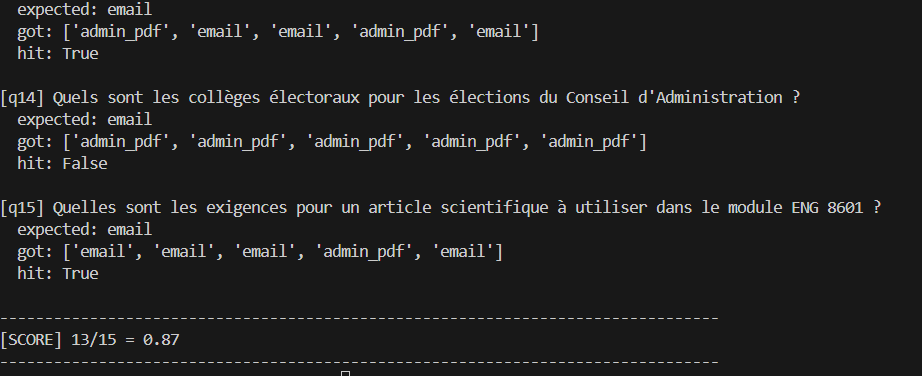
L'amélioration des paramètres permet l'amélioration des résultats

## Conclusion

Le TP a permis de mettre en place un pipeline de retrieval efficace avec Chroma et Ollama, et d’obtenir des résultats pertinents pour certaines questions administratives. Les visualisations et le suivi des emails ont bien fonctionné, tout comme la construction de l’index et la configuration des embeddings. La principale limite est le manque de données et la redondance des chunks, ce qui entraîne des réponses incomplètes ou parfois hors sujet (réponses en anglais ou hallucination en cas de re-run). Dans certains cas , le modèle est incapable de détecter l'information mais il trouve la bonne source. Si le système devait être déployé, l’amélioration prioritaire serait d’augmenter et diversifier la base de documents pour renforcer la robustesse et la fiabilité des réponses en finetuning des hyperparamètres.
