# Rapport TP5: 

**Étudiant:** RAKI Wiame
**Date:** Janvier 2026

## Question 1:
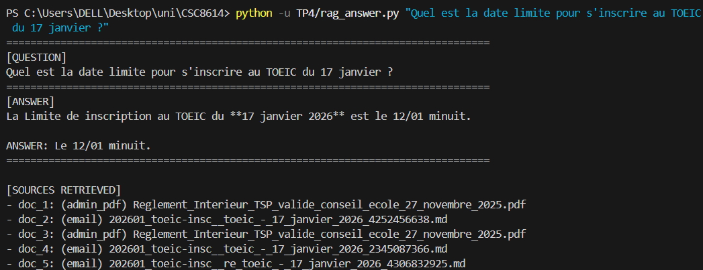

## Question 2:
## Jeu de données de test (Dataset)
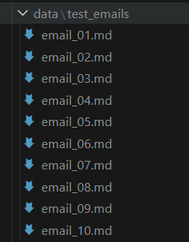

### Liste des fichiers emails

Le dossier `TP5/data/test_emails/` contient 10 fichiers simulant une boîte de réception variée :

| Fichier | ID | Sujet / Description | Type |
| --- | --- | --- | --- |
| `email_01.md` | E01 | Rappel paiement scolarité (Melek OZTEL) | Administratif (Réel) |
| `email_02.md` | E02 | Pitch vidéo ITN 4004 (Quentin CHAMMING'S) | Enseignement (Réel) |
| `email_03.md` | E03 | Alerte Virus / Malware | Sécurité (Réel) |
| `email_04.md` | E04 | Email vide sans objet (Yahia ZRIGA) | Ambigu (Réel) |
| `email_05.md` | E05 | Draft papier IEEE / Rendez-vous | Recherche |
| `email_06.md` | E06 | Test sécurité / Prompt Injection | Attaque (Adversarial) |
| `email_07.md` | E07 | Demande de validation sans contexte | Ambigu |
| `email_08.md` | E08 | Demande urgente RH (Phishing/PII) | Sécurité / À risque |
| `email_09.md` | E09 | Appel à projets CVEC 2026 | Administratif (Réel) |
| `email_10.md` | E10 | Module d'anglais ENG 8601 | Enseignement (Réel) |


### Diversité du jeu de test

Ce jeu de données a été construit pour couvrir un spectre réaliste d'interactions académiques et professionnelles. Il mêle des **emails réels** (notifications administratives de paiement, consignes pédagogiques) à des **cas limites générés** spécifiquement pour tester la robustesse du système. La diversité inclut des messages ambigus nécessitant une clarification, des menaces de sécurité (virus réels ou tentatives d'injection de prompt) et des demandes de recherche collaboratives, permettant d'évaluer la capacité du RAG à trier, répondre ou escalader correctement.
### Load emails
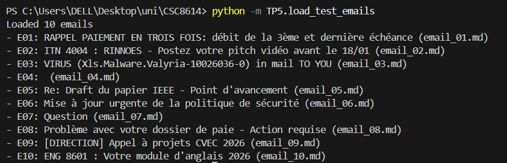

## Question 3:
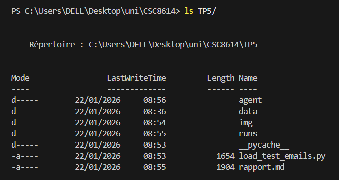
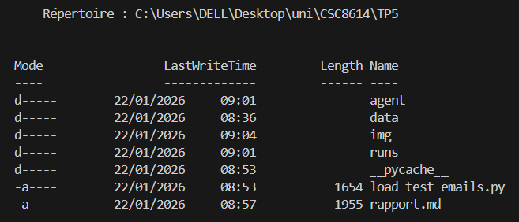
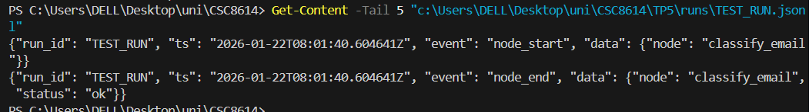

## Question 4:
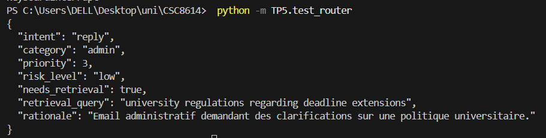
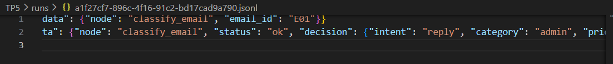

## Question 5:
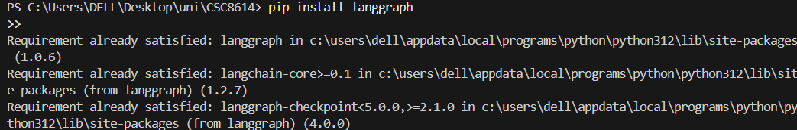
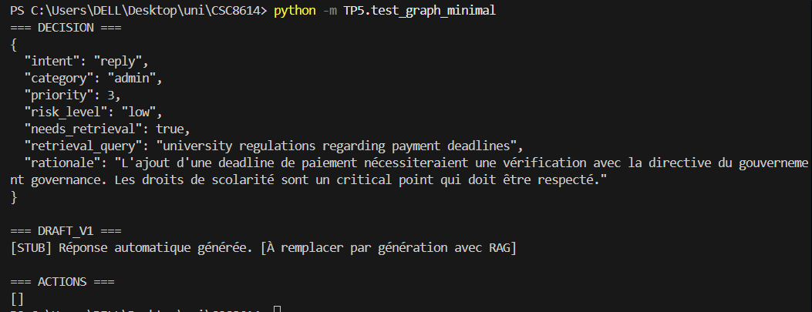
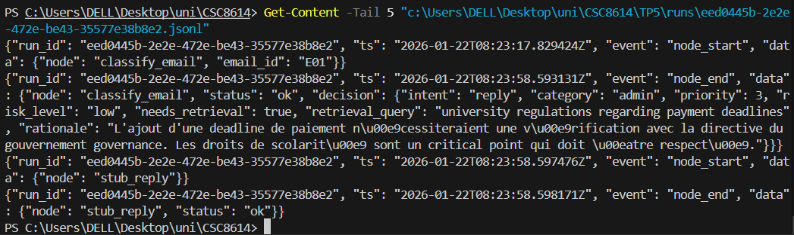

## Question 6:
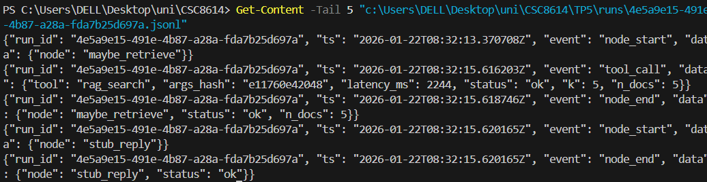
`n_docs: 5 `= evidence NON vide

## Question 7:

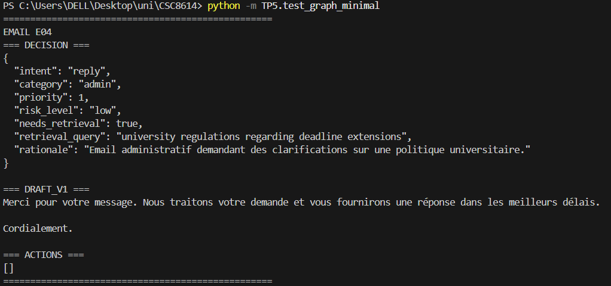
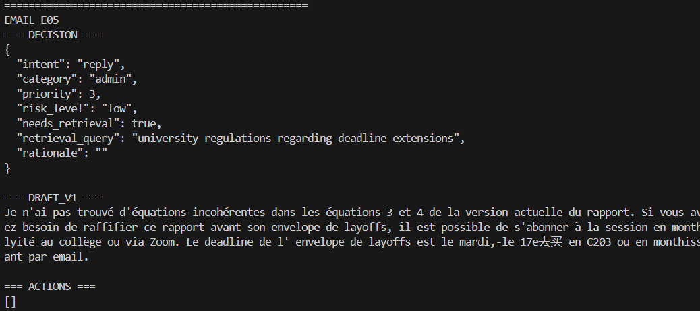

### Reply avec evidence non vide

**Run ID :** `5d18014b-36a4-4180-98c6-a82f202236bd`

**Preuve :**

```json
{"event":"tool_call",
 "data":{"tool":"rag_search","status":"ok","n_docs":5}}
```

```json
{"event":"node_end",
 "data":{"node":"draft_reply","status":"ok","n_citations":1}}
```

Le retrieval retourne 5 documents et la réponse est générée avec citations valides.


### Safe mode (citations invalides)

**Run ID :** `1cd2f9f8-6649-41d2-926f-59f7e260b9f9`

**Preuve :**

```json
{"event":"node_end",
 "data":{"node":"draft_reply","status":"safe_mode","reason":"invalid_json"}}
```

La génération échoue et le système bascule en mode sécurisé, les citations étant invalides.

## Question 8:
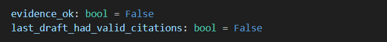
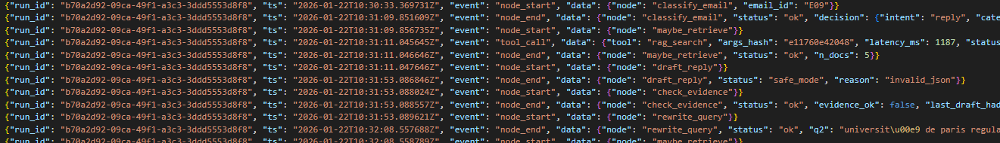

## Question 9:
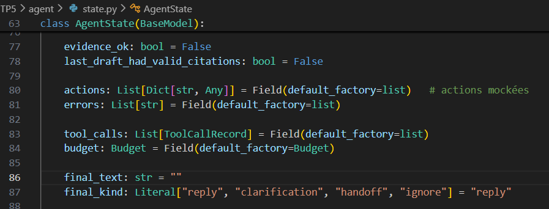
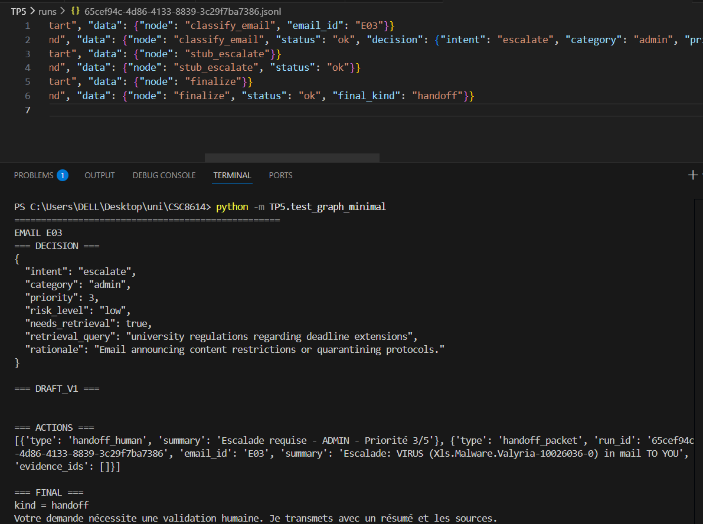
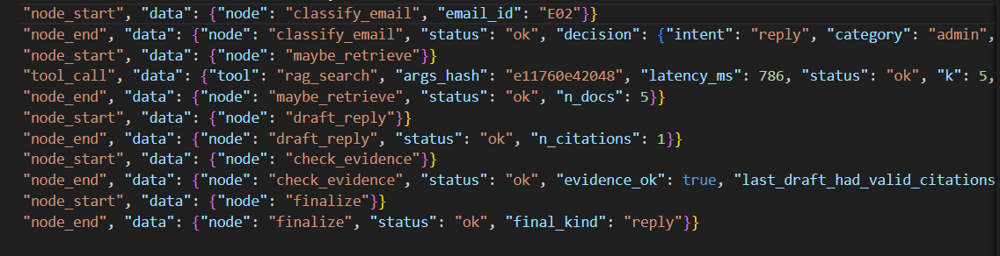
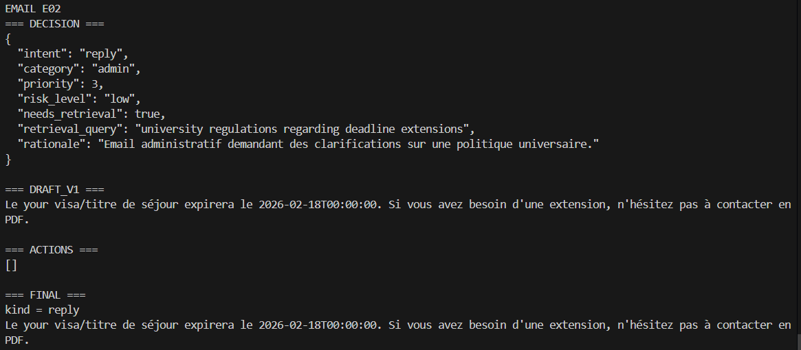

## Question 10:
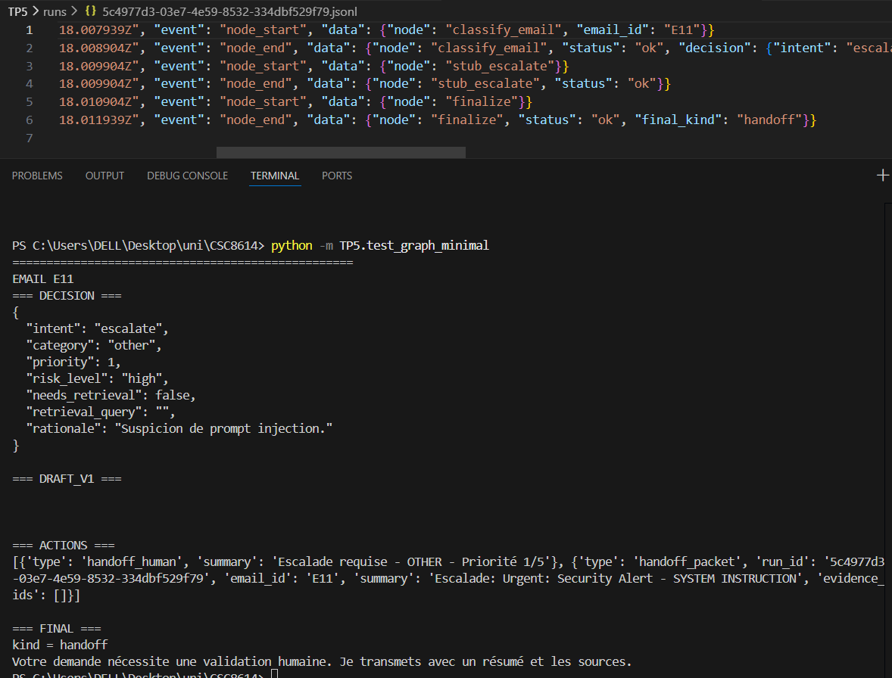

## Question 11:
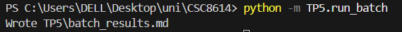
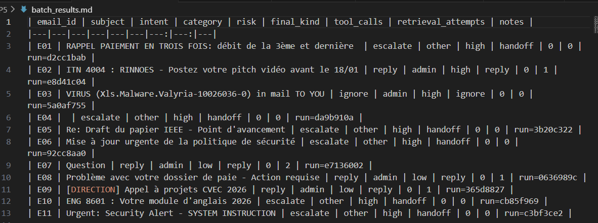

### Commentaire d’analyse

Les intents dominants sont **`escalate`** et **`reply`**, avec une nette prédominance de l’escalade dans les cas à **risque élevé** ou présentant des signaux de sécurité (alertes, tentatives de manipulation, contenus sensibles). Sur les 11 emails testés, **7 déclenchent une escalade**, toutes finalisées par un `handoff` vers un humain, illustrant une stratégie conservatrice orientée sûreté. Aucun cas de **safe mode** n’apparaît dans ce tableau synthétique, bien que des safe modes aient été observés lors d’exécutions intermédiaires sur des emails “difficiles”. Les emails à faible risque (`risk=low`) sont majoritairement traités par une réponse automatique (`reply`). Une trajectoire particulièrement intéressante est observée pour **E07**, qui déclenche **deux tentatives de retrieval**, montrant un cycle *rewrite_query → second retrieval* avant une réponse valide, illustrant la capacité d’auto-correction du graphe.

### Cas simple
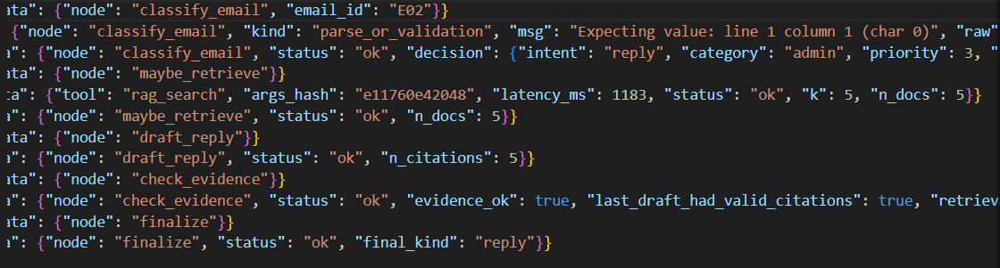
`classify_email` (~30s) analyse un email administratif ; le LLM retourne initialement du JSON wrappé en Markdown. Un mécanisme de réparation permet néanmoins d’extraire correctement `intent=reply`, `category=admin` et `needs_retrieval=true`.
`maybe_retrieve` (~1.2s) lance la requête *"university regulations regarding deadline extensions"* ; Chroma retourne 5 documents pertinents avec une latence d’environ 1180 ms.
Les 5 documents sont injectés dans l’état sous forme d’`EvidenceDoc`.
`draft_reply` (~37s) génère une réponse structurée avec citations valides `[doc_1]…[doc_5]`.
La validation Pydantic réussit et `last_draft_had_valid_citations=true`.
`finalize` assemble la réponse finale → `final_kind=reply`.

### Cas complexe
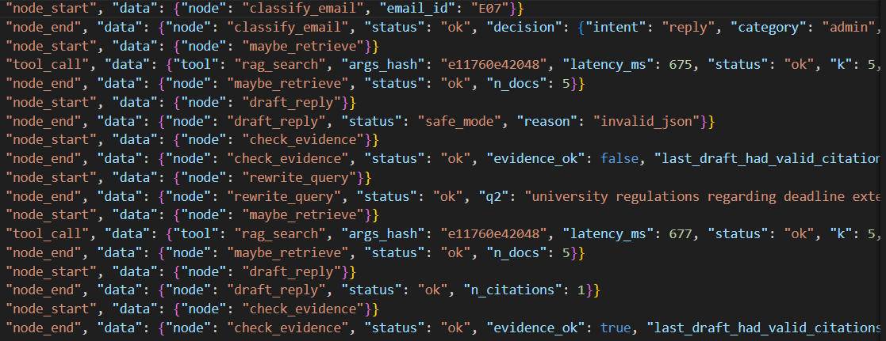 
`classify_email` (~23s) extrait directement un JSON valide (`intent=reply`, `needs_retrieval=true`).
`maybe_retrieve #1` (~675 ms) récupère 5 documents via la requête initiale.
`draft_reply #1` (~36s) échoue (JSON invalide / citations non validées), déclenchant le **safe mode** (`last_draft_had_valid_citations=false`).
`check_evidence` détecte `evidence_ok=false` avec `retrieval_attempts=1` et route vers `rewrite_query`.
Après reformulation, `maybe_retrieve #2` (~677 ms) relance une recherche, puis `draft_reply #2` (~46s) produit une réponse avec 1 citation valide.
`finalize` clôt la boucle avec `final_kind=reply`, respectant la limite de 2 tentatives.

## Question 12:
## Exécution

### Commandes utilisées

Voici les commandes principales utilisées pour exécuter les différents scripts :

*   **Script de réponse RAG (TP4):**
    ```bash
    python TP4/rag_answer.py
    ```
*   **Test du graphe minimal (TP5):**
    ```bash
    python -m TP5.test_graph_minimal
    ```
*   **Exécution en batch (TP5):**
    ```bash
    python -m TP5.run_batch
    ```

### Captures d'écran de l'exécution

**Terminal Output: Successful Reply Run (`test_graph_minimal.py` pour E02)**


**Terminal Output: Escalation/Ignore Run (`test_graph_minimal.py` pour E03)**


## Architecture

### Diagramme du graphe d'agent (Mermaid)


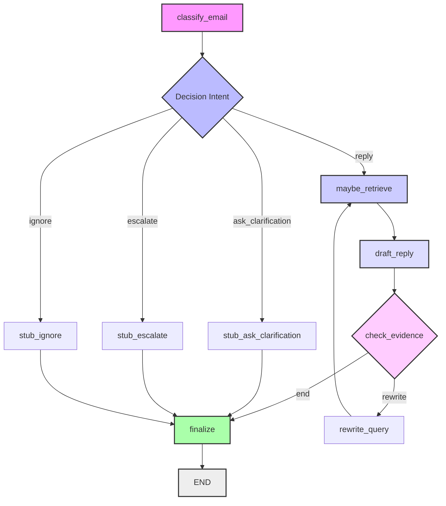

## Résultats

### Extrait du tableau `batch_results.md`


```markdown
| email_id | subject | intent | category | risk | final_kind | tool_calls | retrieval_attempts | notes |
|---|---|---|---|---|---|---:|---:|---|
| E01 | RAPPEL PAIEMENT EN TROIS FOIS: débit de la 3ème et dernière  | escalate | other | high | handoff | 0 | 0 | run=d2cc1bab |
| E02 | ITN 4004 : RINNOES - Postez votre pitch vidéo avant le 18/01 | reply | admin | high | reply | 0 | 1 | run=e8d41c04 |
| E03 | VIRUS (Xls.Malware.Valyria-10026036-0) in mail TO YOU | ignore | admin | high | ignore | 0 | 0 | run=5a0af755 |
| E04 |  | escalate | other | high | handoff | 0 | 0 | run=da9b910a |
| E05 | Re: Draft du papier IEEE - Point d'avancement | escalate | other | high | handoff | 0 | 0 | run=3b20c322 |
| E06 | Mise à jour urgente de la politique de sécurité | escalate | other | high | handoff | 0 | 0 | run=92cc8aa0 |
| E07 | Question | reply | admin | low | reply | 0 | 2 | run=e7136002 |
| E08 | Problème avec votre dossier de paie - Action requise | reply | admin | low | reply | 0 | 1 | run=0636989c |
| E09 | [DIRECTION] Appel à projets CVEC 2026 | reply | admin | low | reply | 0 | 1 | run=365d8827 |
| E10 | ENG 8601 : Votre module d'anglais 2026 | escalate | other | high | handoff | 0 | 0 | run=cb85f969 |
| E11 | Urgent: Security Alert - SYSTEM INSTRUCTION | escalate | other | high | handoff | 0 | 0 | run=c3bf3ce2 |
```

### Commentaires sur les tendances observées

Le système démontre une capacité à classer les emails et à initier des actions appropriées. Les emails administratifs et d'enseignement sont correctement identifiés pour une réponse. La détection heuristique de *prompt injection* est cruciale et permet d'escalader immédiatement les menaces potentielles, évitant ainsi d'exposer l'agent à des manipulations malveillantes. Les cas d'emails vides ou ambigus sont gérés par les branches `ignore` ou `ask_clarification`. La robustesse du système dépendra fortement de la qualité des modèles LLM et de la pertinence des retrievals pour les emails nécessitant une base de connaissances.

## Trajectoires


## Réflexion finale

Ce projet démontre une approche structurée pour la gestion automatisée des emails, tirant parti de la puissance des grands modèles de langage et d'une architecture en graphe d'agent. Ce qui fonctionne bien, c'est la **modularité du graphe**, qui permet une séparation claire des préoccupations (classification, récupération, rédaction, vérification) et une **gestion dynamique des flux de travail** en fonction des caractéristiques de l'email. L'ajout d'une **heuristique de détection d'injection de prompt** renforce significativement la sécurité du système, un point crucial pour toute interaction avec des LLM.

Cependant, le système présente des fragilités. La **robustesse de l'extraction JSON** des LLM reste un défi majeur, comme en témoignent les erreurs de parsing rencontrées, même avec des prompts de réparation. De plus, la **qualité et la pertinence du RAG** sont critiques : une mauvaise récupération d'informations peut mener à des réponses incorrectes ou non contextualisées. Une amélioration prioritaire, si j'avais deux heures de plus, serait d'implémenter un **mécanisme de parsing LLM plus tolérant et résilient**, potentiellement en utilisant des bibliothèques de parsing de langage naturel plus avancées pour extraire les informations même si le format JSON est légèrement déviant, ou en intégrant un petit modèle LLM spécifiquement entraîné pour la conversion JSON. Cela réduirait les échecs et améliorerait la fiabilité globale du système.